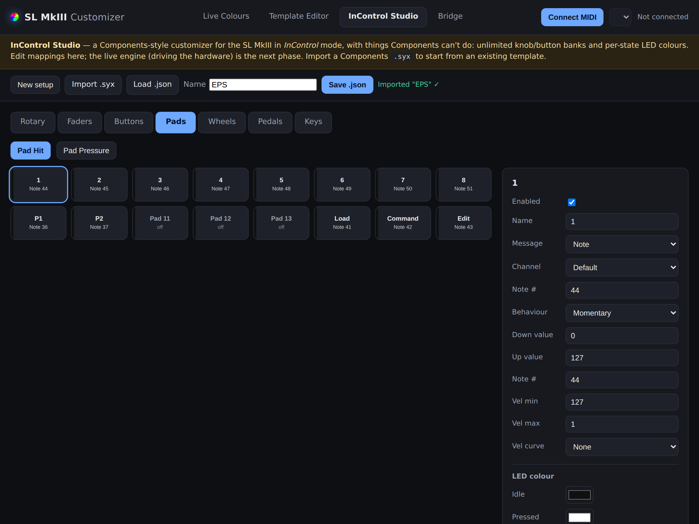
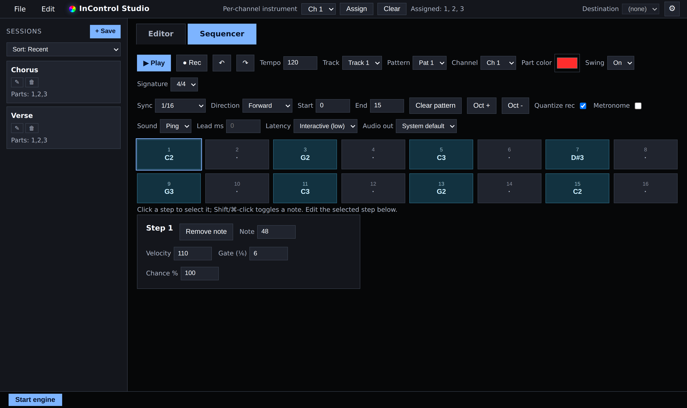

# InControl Studio — Novation SL MkIII

Run the Novation SL MkIII in **InControl** mode as a full, standalone-style
instrument + step sequencer — controlled entirely from the hardware — with
**custom RGB LED colors** on every pad, button and fader, the thing **Novation
Components doesn't let you do** even though the hardware supports it.

It's a single web/Electron app — **InControl Studio** — with two top-level tabs:

- **Editor** — a Components-style customizer with *more* than Components allows:
  a **template library** you map to the 8 Parts, unlimited knob/button banks,
  per-state LED colors, and richer message types (14-bit, NRPN, combined
  continuous bank-change). Imports Components `.syx` templates and
  `.slmkiiipack` packs.
- **Sequencer** — a step sequencer modelled on the SL MkIII's own (8 tracks ×
  8 patterns × 16 steps), with a **session library**, on-screen grid, transport,
  and a look-ahead metronome. Plays back imported Components sessions.

The whole surface — pads, soft buttons, knobs, screens, transport, Options mode —
is driven live from the SL so you can work without looking at the computer. MIDI
ports **auto-detect** and the engine **auto-starts**; a **File / Edit** menu bar
sits top-left, **Per-channel instrument** top-middle, **Start engine +
Destination** top-right, and a **⚙ settings** drawer holds port overrides and a
**light/dark theme** toggle.



## Build & run locally

No GitHub Actions needed — everything builds on your machine.

### Web app (fastest, no install)

Serve the repo root and open it in a Chromium browser (Chrome / Edge / Opera —
they have the **Web MIDI API with SysEx**):

```bash
python3 -m http.server 8000
# then open http://localhost:8000
```

Any static server works (`npx serve`, VS Code Live Server, …). Put the SL MkIII
in **InControl** mode and approve the MIDI/SysEx prompt. A browser can't create a
virtual MIDI port, so pick an existing one as the **Destination** (an **IAC** bus
on macOS, a **loopMIDI** port on Windows).

### Desktop app (Electron, native MIDI)

Needs **Node.js**. Native MIDI runs in Electron's main process via
[`@julusian/midi`](https://www.npmjs.com/package/@julusian/midi), and on
macOS/Linux the app **creates its own virtual port** (`SL MkIII Bridge`), so no
IAC/loopMIDI setup is required.

```bash
cd desktop
npm install      # electron + @julusian/midi (prebuilt binaries)
npm start        # dev run — the full native-MIDI app
```

Build an installer:

```bash
npm run dist     # stages the web UI into ./app, then runs electron-builder
```

Output lands in **`desktop/dist/`** — `.exe` (Windows), `.dmg`/`.zip` (macOS),
`.AppImage` (Linux).

- **Build on the OS you're shipping for.** `electron-builder` doesn't reliably
  cross-compile the native MIDI module, so run `npm run dist` on Windows for the
  `.exe`, macOS for the `.dmg`, etc.
- **First build needs internet** (downloads the Electron binary once).
- **Windows:** it can't create a virtual port — install
  [loopMIDI](https://www.tobias-erichsen.de/software/loopmidi.html), make a
  port, and select it as the Destination. The build is unsigned, so SmartScreen
  warns on first launch → **More info → Run anyway**.

(A `.github/workflows/build-desktop.yml` can also build the Windows installer on
GitHub Actions if you'd rather not build locally, but it's optional.)

## Using it

1. Connect the SL MkIII by USB and press the **InControl** button on the unit.
2. Open the app (web or desktop). Ports auto-detect and the engine auto-starts;
   override them in **⚙ settings** if needed, and set a **Destination** port for
   your DAW/synth to receive the mapped MIDI and the sequencer's notes.
3. **Editor** tab: build/import templates in the left library, map each to a
   Part (the 1-8 dots), and edit any control's mapping + LED color — changes
   push to the hardware live.
4. **Sequencer** tab: program steps, hit **Play**, and drive everything from the
   SL. Save the arrangement as a **session** (left column).

### On the hardware (InControl mode)

- **Pads** are the step grid (or playable notes via **Grid**); play head, used
  steps, and the current step are shown in the Part color with a white head.
- **Soft buttons 1-8** (below the screens) select the Part/channel; **9-24**
  (above the faders) are the **Mute/Solo** bank — or, once you page button banks,
  your own button banks.
- **Options** enters editing mode: soft buttons pick **Velocity / Gate / Chance
  / Tempo / Pattern**, knobs 1-8 edit the value, the screens show it, and the top
  six above-fader buttons become **micro-steps**.
- The sequencer sends **MIDI clock** to the SL so its **arpeggiator** and other
  tempo-driven features lock to the sequence (set the SL's Clock Source to
  External/Auto).



## Templates & LED colors (important)

A common question: *can I bake custom LED colors into the stored **templates**
(the ones Components saves as `.syx`)?*

**Short answer: no — the template format doesn't carry LED colors.** The
template `.syx` format is fully reverse-engineered (see
[docs/TEMPLATE-FORMAT.md](docs/TEMPLATE-FORMAT.md)) with a bit-exact round-trip:
templates store control **mappings** (MIDI type, CC/note, channel, value range) —
every color-looking `7F` byte is actually a control's max value (127). That's
why Components has no template LED-color UI. Custom colors are only
controllable **live** via the InControl SysEx API — which is what this app does.

## Save / import / export

- **Save / Load `.json`** — the entire setup: control mappings, LED colors, the
  template library, the session library, and the sequencer.
- **Import `.syx`** — a Components template, added to the template library.
- **Import pack** (`.slmkiiipack`) / **Import sessions** (`.syx`) — Components
  packs and sessions; sessions land in the Sequencer's session library and play
  back.
- **Export `.syx`** — writes the active template back out as a Components
  template (bit-exact codec with recomputed CRC-32, so it re-imports cleanly).

## Bridge (optional, headless)

For always-on use there's a standalone Node service in
[`bridge/`](bridge/README.md) that creates its own virtual port and re-asserts
colors + remaps InControl messages without the app open:

```bash
cd bridge && npm install
node bridge.js --list                 # find your ports
cp config.example.json config.json    # edit colors + mappings
node bridge.js                        # SL MkIII in InControl mode
```

## Browser support

The web build needs the **Web MIDI API with SysEx**: Chrome, Edge, Opera
(desktop). Safari and Firefox don't support Web MIDI SysEx — use one of those,
the exported `.syx` with a native SysEx tool, or the **desktop app** (works
everywhere, no Web MIDI needed).

## Tests

Pure Node, no framework:

```bash
for t in test/*.test.js; do node "$t"; done
```

## How it works

- [`js/sysex.js`](js/sysex.js) — builds the `F0 00 20 29 02 0A 01 …` LED / screen
  messages and 8-bit ⟷ 7-bit color conversion.
- [`js/incontrol.js`](js/incontrol.js) — resolves incoming InControl messages
  (pads, buttons, knobs, faders, pad pressure) to named controls.
- [`js/midi.js`](js/midi.js) — Web MIDI wrapper (and an Electron native backend);
  auto-detects the SL's InControl / keys ports.
- [`js/studio-model.js`](js/studio-model.js) — the data model: controls, banks,
  per-state colors, the template + session libraries.
- [`js/studio-engine.js`](js/studio-engine.js) — pure control→MIDI + LED logic.
- [`js/studio-runtime.js`](js/studio-runtime.js) — the live engine: reads the SL,
  drives LEDs/screens, runs the sequencer clock, records, sends MIDI + clock.
- [`js/studio-options.js`](js/studio-options.js) — the Options-mode menus/screens.
- [`js/studio-sequencer.js`](js/studio-sequencer.js) — the tick-driven sequencer.
- [`js/studio-ui.js`](js/studio-ui.js) / [`js/studio-sequencer-ui.js`](js/studio-sequencer-ui.js)
  — the on-screen Editor and Sequencer.
- [`js/sltemplate.js`](js/sltemplate.js) / [`js/pack.js`](js/pack.js) /
  [`js/session.js`](js/session.js) — the template, pack, and session codecs.
- [`docs/PROTOCOL.md`](docs/PROTOCOL.md) — message reference;
  [`docs/SEQUENCER-CONTROL.md`](docs/SEQUENCER-CONTROL.md) — hardware control map;
  [`docs/SESSION-FORMAT.md`](docs/SESSION-FORMAT.md) /
  [`docs/TEMPLATE-FORMAT.md`](docs/TEMPLATE-FORMAT.md) — the file formats.

## Disclaimer

Not affiliated with or endorsed by Novation / Focusrite. "Novation" and
"SL MkIII" are trademarks of their respective owners. Protocol details come from
Novation's publicly published Programmer's Reference Guide. Use at your own risk.

## License

MIT — see [LICENSE](LICENSE).
