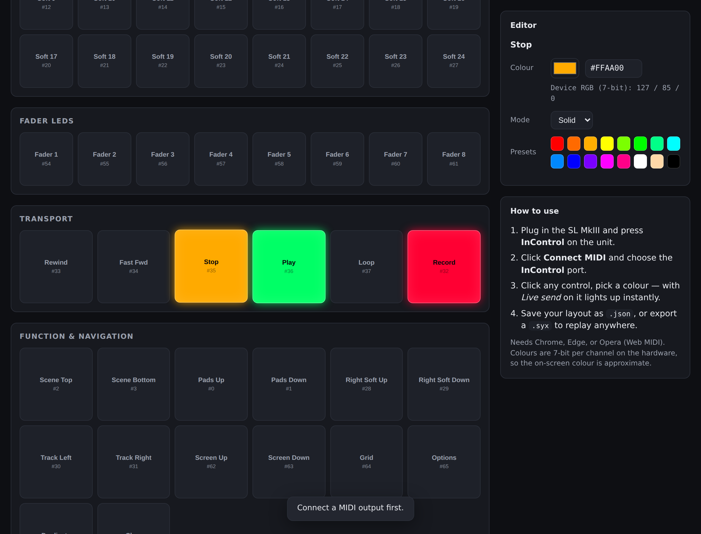
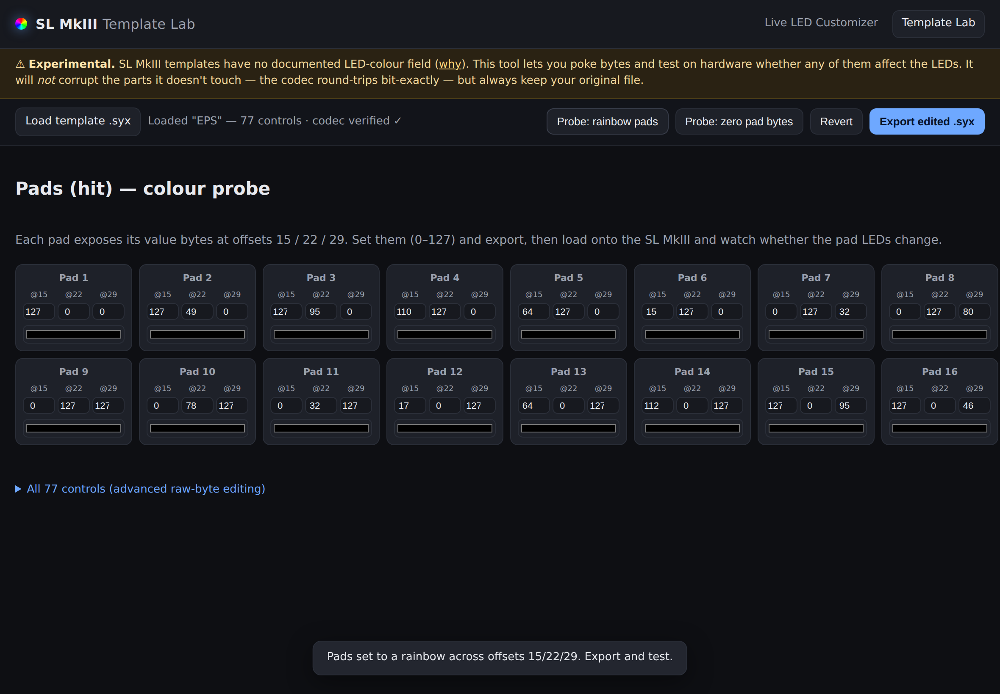
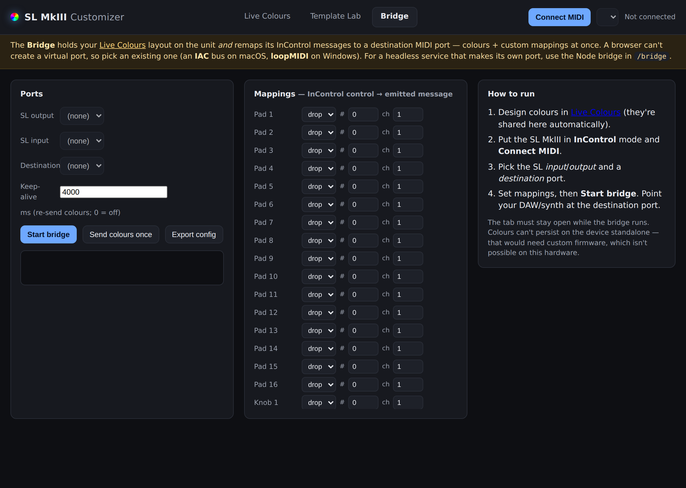

# Novation SL MkIII — LED Colour Customizer

A browser-based tool to set **custom RGB colours** on the Novation SL MkIII's
pads, buttons and fader LEDs — the thing **Novation Components doesn't let you
do**, even though the hardware fully supports it.

It's a single app with three tabs sharing one MIDI connection:

- **Live Colours** — click a pad, pick a colour, watch it light up over the
  Web MIDI API using the documented InControl SysEx protocol.
- **Template Lab** — decode/edit the `.syx` templates Components saves
  (bit-exact codec with recomputed checksum). Templates *can't* carry LED
  colours — this proves why and lets you re-test on hardware.
- **Bridge** — hold your colours on the unit **and** remap its InControl
  messages to another MIDI port, so you get colours + custom mappings live.



## What's possible (short answer)

Yes — you can set **arbitrary colours**. The SL MkIII accepts a SysEx "Set LED"
command carrying a 7-bit-per-channel RGB value for every pad, soft button,
transport button and fader LED. Each LED can be **solid**, **flashing**, or
**pulsing**. Components only offers a fixed template workflow and hides this;
the [Programmer's Reference Guide](docs/PROTOCOL.md) documents the raw messages,
and this app implements them.

The one thing that's *not* cleanly addressable is the keybed "light guide" —
its LED IDs overlap other controls in the official spec, so it's intentionally
left out. See [docs/PROTOCOL.md](docs/PROTOCOL.md).

## Quick start

1. Connect the SL MkIII by USB and press the **InControl** button on the unit.
2. Open the app:
   - **Easiest:** serve the folder and open it in Chrome/Edge/Opera:
     ```bash
     python3 -m http.server 8000
     # then visit http://localhost:8000
     ```
   - Opening `index.html` directly (`file://`) also works in most Chromium
     builds, but a local server is the reliable path for Web MIDI + SysEx.
3. Click **Connect MIDI**, grant the SysEx permission, and pick the
   **InControl** output port.
4. Click any control, choose a colour. With **Live send** on, it updates the
   hardware immediately.

## Features

- Visual editor for all **68** addressable LEDs, grouped by section.
- Full RGB colour picker + hex entry + one-click preset swatches.
- Per-LED **solid / flash / pulse** mode.
- Multi-select (Shift/Ctrl-click) to colour many controls at once.
- **Live send** to hardware, plus **Send all**, **All off**, and **Rainbow**.
- **Save/Load** your layout as `.json`.
- **Export `.syx`** (a Standard MIDI SysEx file you can replay from any SysEx
  utility) or **Copy SysEx** hex to the clipboard.
- Layout autosaves to the browser between sessions.

## Templates & LED colours (important)

A common question: *can I bake custom LED colours into the stored **templates**
(the ones Components saves as `.syx`)?*

**Short answer: no — the template format doesn't carry LED colours.** I fully
reverse-engineered the template `.syx` format (see
[docs/TEMPLATE-FORMAT.md](docs/TEMPLATE-FORMAT.md)) and verified a bit-exact
round-trip. Templates store control **mappings** (MIDI type, CC/note, channel,
value range) — every colour-looking `7F` byte is actually a control's max value
(127). Novation's User Guide confirms it. That's precisely why Components has no
template LED-colour UI. Custom colours are only controllable **live** via the
InControl SysEx API — which is what the main tool does.

**This was confirmed on real hardware:** a rainbow probe that wrote distinct
values to every pad's value bytes (with a valid recomputed checksum, imported
via Components) produced **no** colour change; and live RGB SysEx only affects
LEDs in InControl view. So custom colours are strictly a live, InControl feature.

### Template Lab (a tab)

The **Template Lab** tab decodes a template into all 77 control records
(bit-exact codec that **recomputes the file's CRC-32** on export, so edits import
cleanly into Components), lets you poke bytes, and re-run the colour probe if you
want to verify it yourself. It's now a genuinely safe template editor — it just
can't do colours, because nothing in the format does.



## Bridge — colours *and* your own mappings, live

Custom colours only exist in InControl mode, where controls send *fixed* messages
instead of your template's mapping. The **Bridge** reconciles that: it holds your
colours on the unit (re-asserting them so they stick) **and** remaps the fixed
InControl messages to another MIDI port your DAW/synth reads. Colours + custom
mappings at once, no firmware — while it's running.



Two ways to run it:

- **In the app** (Bridge tab) — pick an existing destination port (a browser
  can't create one: use an **IAC** bus on macOS or **loopMIDI** on Windows).
- **Headless** (`bridge/` Node service) — creates its own virtual port, good for
  always-on use. See [bridge/README.md](bridge/README.md):
  ```bash
  cd bridge && npm install
  node bridge.js --list                 # find your ports
  cp config.example.json config.json    # edit colours + mappings
  node bridge.js                        # SL MkIII in InControl mode
  ```
  The app's **Export config** button writes a `bridge-config.json` the Node
  service reads directly.

## Desktop app (Electron)

Prefer a real app? [**`desktop/`**](desktop/) is an Electron build of the same
three tabs with **native MIDI** — and it can **create its own virtual port**, so
the Bridge needs no IAC/loopMIDI setup (the port `SL MkIII Bridge` just appears
for your DAW). All MIDI runs in the main process via `@julusian/midi`; the shared
`js/midi.js` auto-detects Electron and routes through it instead of Web MIDI.

```bash
cd desktop
npm install
npm start            # dev run
npm run dist         # build a .dmg / .exe / .AppImage
```

See [desktop/README.md](desktop/README.md).

## Browser support

The browser build requires the **Web MIDI API with SysEx**: Chrome, Edge, and
Opera (desktop). Safari and Firefox don't support Web MIDI SysEx — use one of
those, the exported `.syx` with a native SysEx tool, or the **desktop app**
above (works everywhere, no Web MIDI needed).

## How it works

- [`js/sysex.js`](js/sysex.js) — builds the `F0 00 20 29 02 0A 01 03 …` LED
  messages and handles 8-bit ⟷ 7-bit colour conversion.
- [`js/controls.js`](js/controls.js) — the map of every LED and its SysEx id.
- [`js/midi.js`](js/midi.js) — Web MIDI wrapper (ports, send, input subscribe).
- [`js/app.js`](js/app.js) — the Live Colours editor, sending and import/export.
- [`js/template.js`](js/template.js) / [`js/template-lab.js`](js/template-lab.js)
  — template codec (7-to-8 encoding, records, CRC-32) and the Template Lab UI.
- [`js/incontrol.js`](js/incontrol.js) / [`js/bridge-web.js`](js/bridge-web.js)
  — InControl message resolution/remap and the in-app Bridge.
- [`js/tabs.js`](js/tabs.js) — tab switching with `#hash` deep-links.
- [`docs/PROTOCOL.md`](docs/PROTOCOL.md) — the full message reference;
  [`docs/TEMPLATE-FORMAT.md`](docs/TEMPLATE-FORMAT.md) — the template format.

## Disclaimer

Not affiliated with or endorsed by Novation / Focusrite. "Novation" and
"SL MkIII" are trademarks of their respective owners. Protocol details come
from Novation's publicly published Programmer's Reference Guide. Use at your
own risk.

## License

MIT — see [LICENSE](LICENSE).
